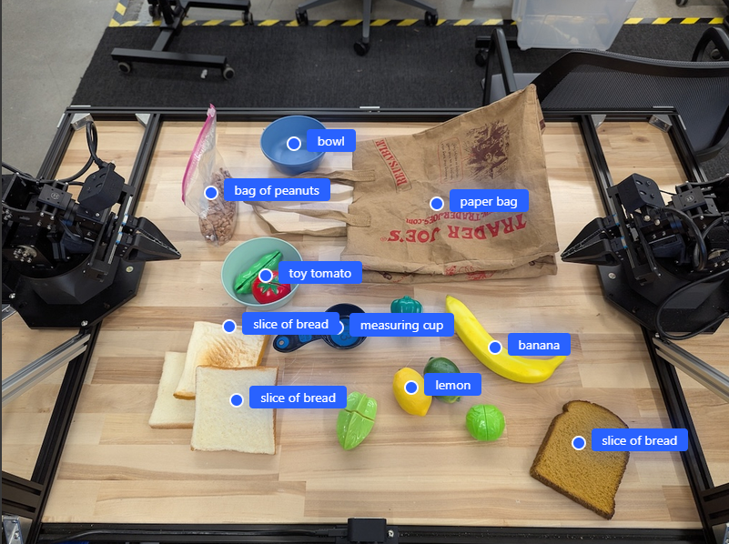
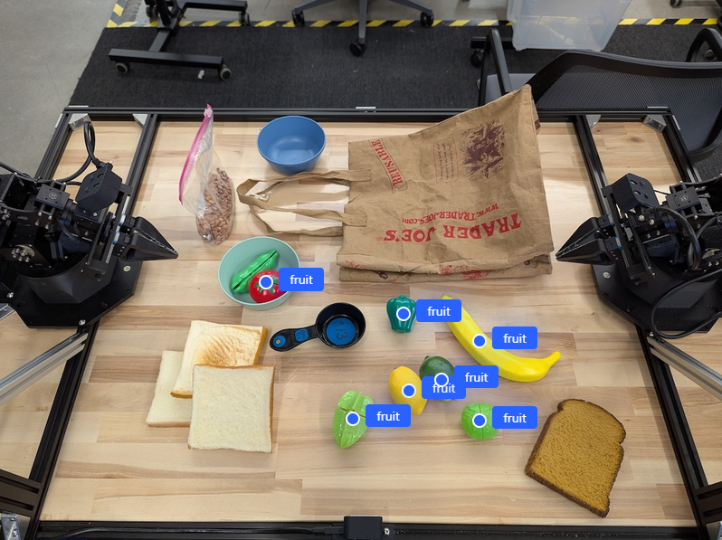
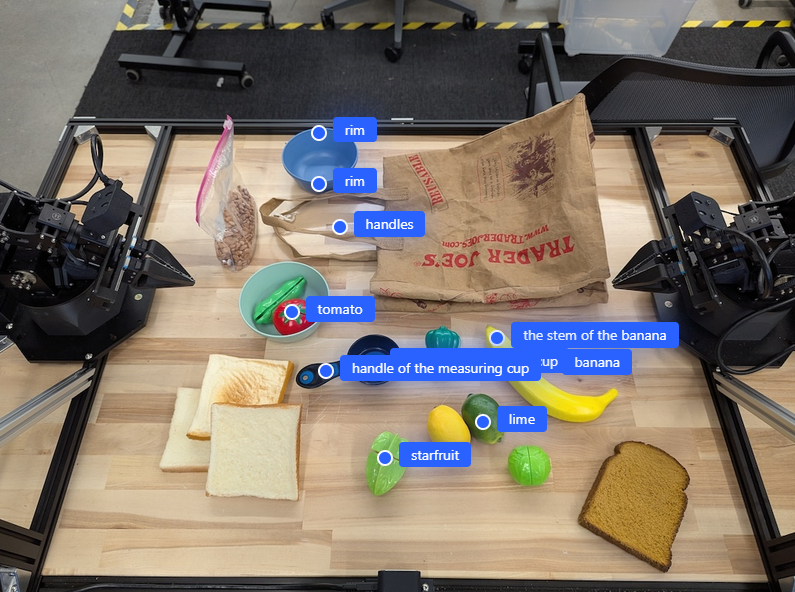
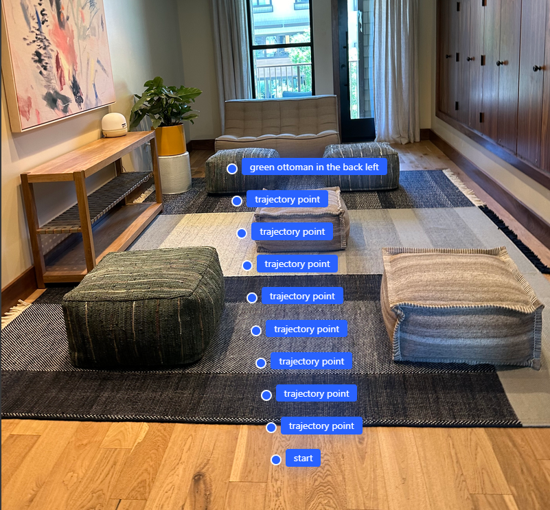
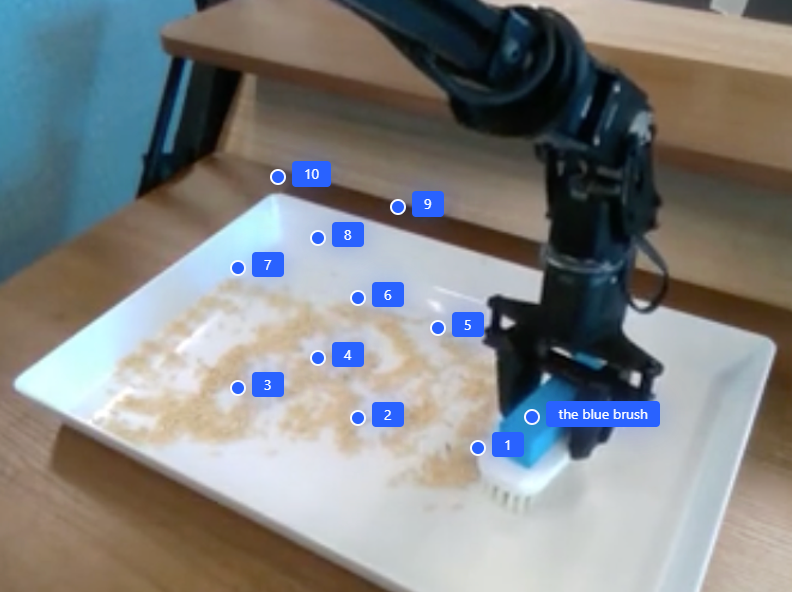
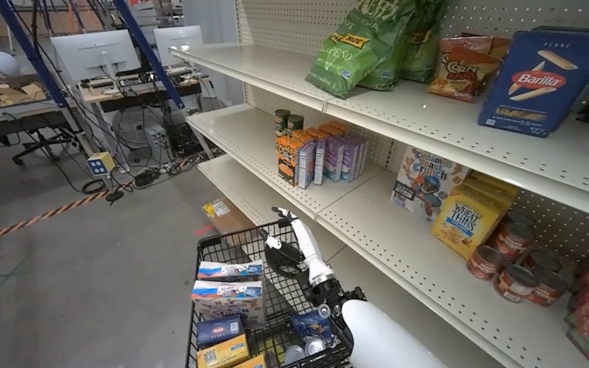
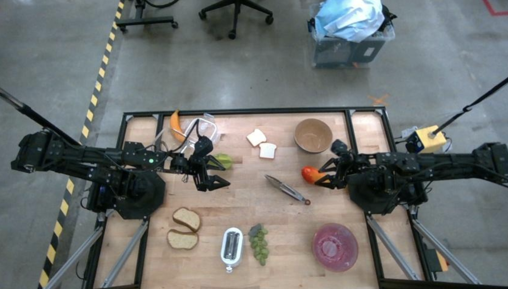
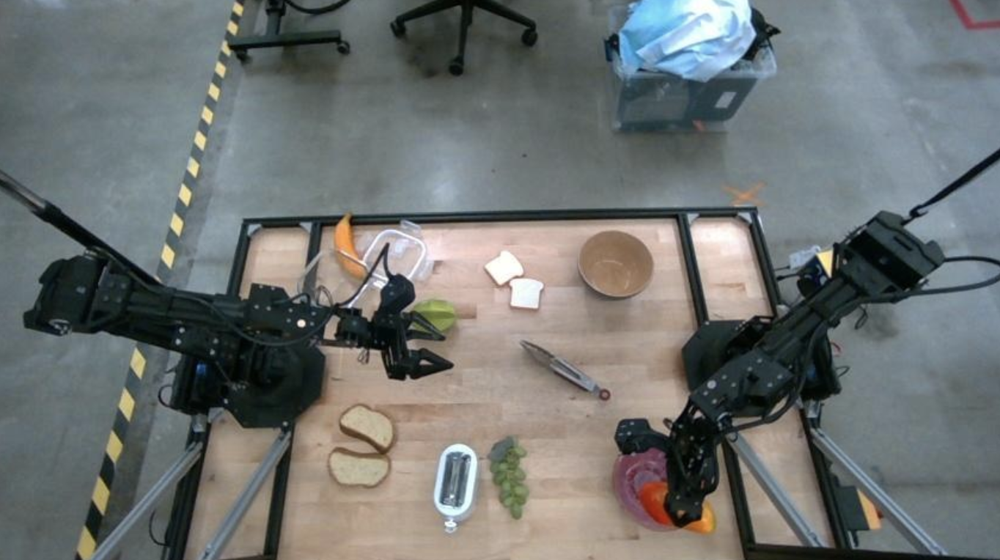

# Gemini Robotics ER 1.5 Insight Hub 

[](https://deepmind.google/technologies/gemini/)
[](https://aistudio.google.com/)
[](https://github.com/google-gemini/cookbook)

> **🚀 INSIGHTS FROM THE EARLY TRUSTED TESTER PROGRAM**
> This repository is a curated collection of resources, patterns, and "better" updates for Gemini Robotics, maintained by an **Early Trusted Tester**.
>
> My goal is to bridge the gap between closed research and practical application. Here, you will find use-cases, cookbooks, and projects that push the boundaries of what's possible with Embodied Reasoning (ER) models.

---

## 🤖 What is Gemini Robotics ER 1.5?

**Gemini Robotics-ER 1.5** is a specialized Vision-Language-Action (VLA) model designed to be the "brain" of next-generation robots. Unlike standard LLMs, it features **Embodied Reasoning**: the ability to understand 3D space, physics, and causal relationships in the physical world.

### Key Capabilities
| Capability | Description | Application |
|------------|-------------|-------------|
| **Spatial Grounding** | Precise 2D/3D coordinate output (points, boxes). | Grasping, segmentation, navigation. |
| **Temporal Reasoning** | Understanding "what happened when" in video. | Success detection, security monitoring. |
| **Long-Horizon Planning** | Breaking complex tasks into primitives. | "Clean the kitchen" → 15 robot actions. |
| **Tool Use** | Natively calling external APIs (Search, Code). | Sorting trash by local rules, checking weather. |

---

## ⚡ Quick Start

### 1. Installation
```bash
pip install google-generativeai pillow numpy
```

### 2. Basic Perception Script
*See [`examples/basic_spatial_query.py`](./examples/basic_spatial_query.py) for the full runnable script.*

```python
import google.generativeai as genai
from PIL import Image

# Initialize the ER 1.5 Preview Model
model = genai.GenerativeModel('gemini-robotics-er-1.5-preview')

# Ask for precise coordinates
response = model.generate_content([
    "Point to the handle of the mug. Return [y, x] coordinates.",
    Image.open('robot_view.jpg')
])
print(response.text)
```

---

### 📸 Visual Use Case Gallery

Use these reference patterns to prompt the model effectively.

### 📍 Spatial Awareness & Finding Objects

#### 1. Pointing to Undefined/Novel Objects
*Ask the robot to identify everything, even if it hasn't seen it before.*


#### 2. Abstract Description Finding ("Find all Fruit")
*The model understands categories, not just rigid labels.*


#### 3. Serial Part Identification
*Drilling down into specific object parts (handle, rim, stem) for grasping.*


---

### 🗺️ Trajectory & Path Planning

#### 4. Collision-Free Path Planning
*Asking the model to generate waypoints `(x,y)` to navigate around obstacles.*


#### 5. Complex Trajectories (e.g., Brushing)
*Fine-grained manipulation paths.*


---

### 🧠 Reasoning & Logic

#### 6. "Reasoning by Counting"
*The model doesn't just guess; it can explain **why** it thinks there are 8 items.*


#### 7. Success Detection (Temporal Video Analysis)
*Did the robot actually finish the job? Compare start and end states.*
| Start State | End State |
|-------------|-----------|
|  |  |

---

## 📂 Included Examples
| File | Focus | Description |
|------|-------|-------------|
| [`examples/basic_spatial_query.py`](./examples/basic_spatial_query.py) | **Vision** | Get X,Y coords for grasping handles. |
| [`examples/task_decomposition.py`](./examples/task_decomposition.py) | **Planning** | Break "clean table" into "pick, move, place". |
| [`examples/tool_use_recycling.py`](./examples/tool_use_recycling.py) | **Agentic** | Search Google to check if plastic is recyclable. |
| [`examples/video_anomaly_detection.py`](./examples/video_anomaly_detection.py) | **Video** | Audit long robot videos for safety violations. |
| [`INTERESTING_PROMPTS.md`](./INTERESTING_PROMPTS.md) | **Experiments** | "The Hazmat Navigator", "Grocery Packer", and other advanced prompts. |

---

## 🔮 Roadmap: Cookbooks & Projects

We are actively working on full-stack examples for the next release:
- [ ] **ROS 2 Integration Node**: Drop-in `ros2 run` package.
- [ ] **Sim-to-Real Pipeline**: Isaac Sim to Realman/Franka arm.
- [ ] **VLA Fine-tuning Guide**: How to adapt the model to *your* arm.

---

<p align="center">
  <i>Curated with ❤️ by Pruthvi Geedh.</i>
</p>
